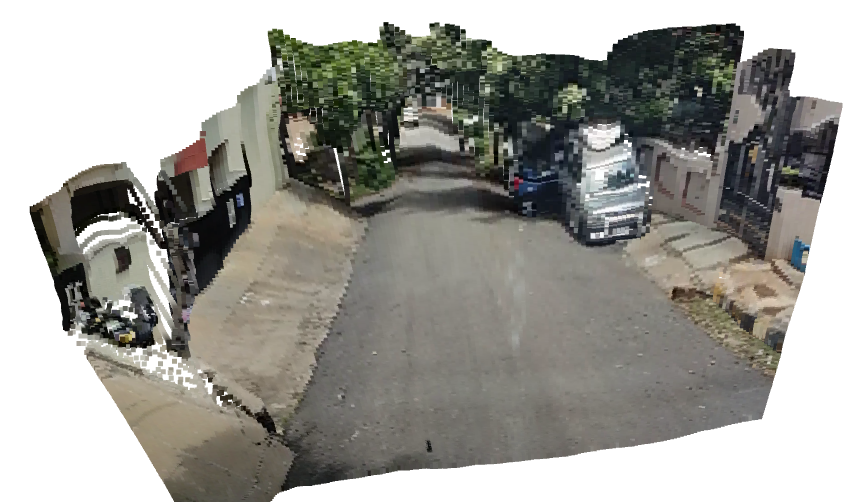

# BDD Dataset Iterator

This is a demo of how to use the BDD dataset iterator.

<p>
    
</p>

Point Cloud               |  RGB
:-------------------------:|:-------------------------:
  |  
  |  


To run the demo:
```bash
python3 -m bdd_dataset_iterator
```

# Cite Bengaluru Driving Dataset from the OCTraN paper

Please cite our paper if you find this repo helpful

```bib
@misc{analgund2023octran,
  title={OCTraN: 3D Occupancy Convolutional Transformer Network in Unstructured Traffic Scenarios},
  author={Ganesh, Aditya N and Pobbathi Badrinath, Dhruval and Kumar, Harshith Mohan and S, Priya and Narayan, Surabhi},
  year={2023},
  howpublished={Spotlight Presentation at the Transformers for Vision Workshop, CVPR},
  url={https://sites.google.com/view/t4v-cvpr23/papers#h.enx3bt45p649},
  note={Transformers for Vision Workshop, CVPR 2023}
}
```